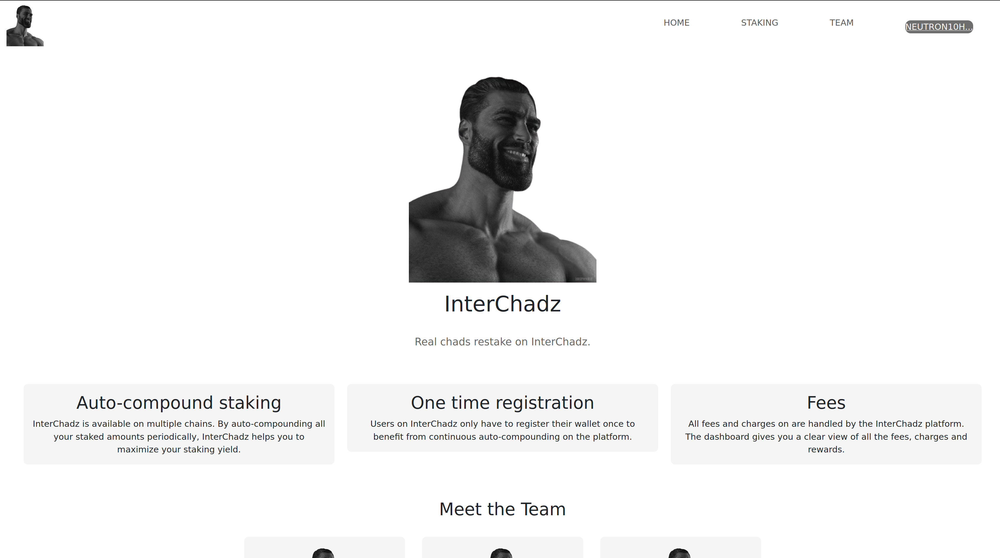
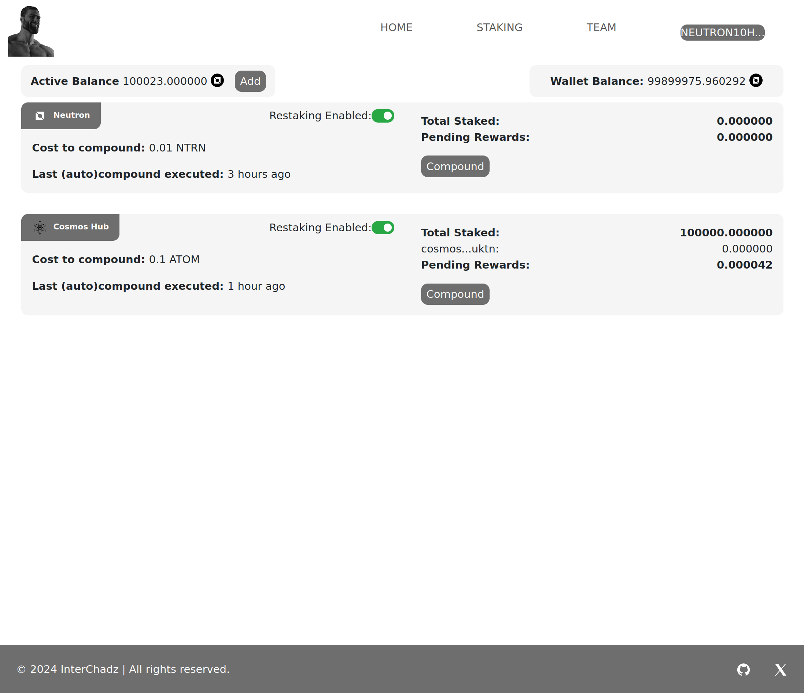
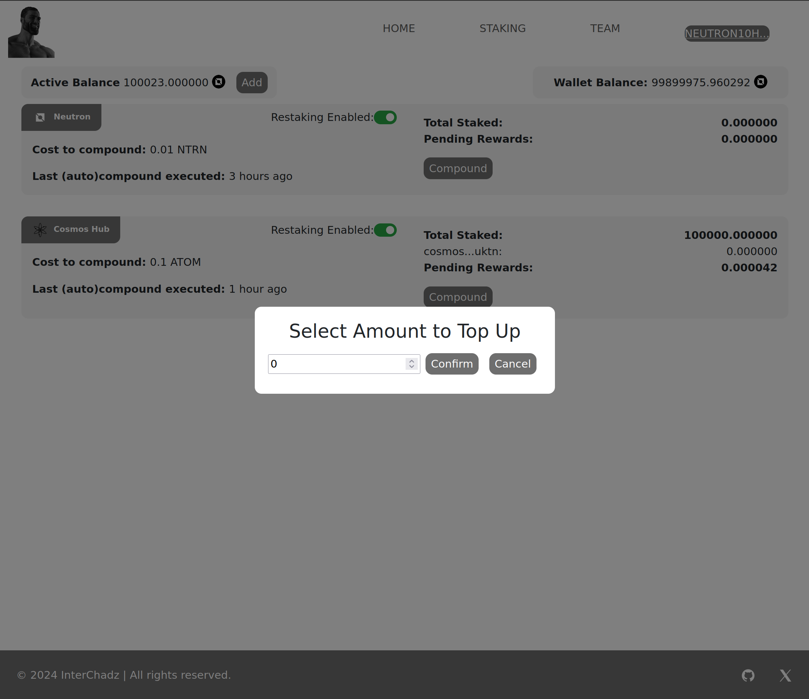
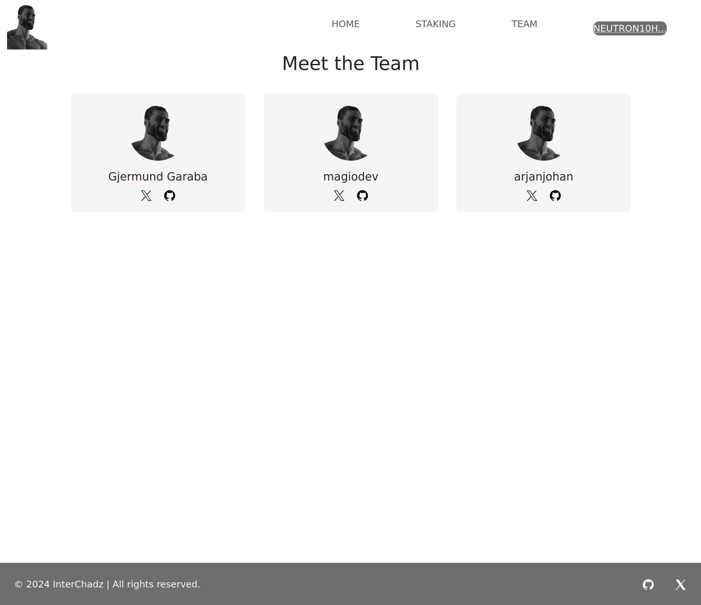

  <h1 align="center">InterChadz</h1>
  <h3>ICA Stake Auto Compounder on Neutron</h3>
  

💡 This project is a decentralized staking auto-compounder that leverages ICA, authz and Neutron to
let the user set-and-forget their staking positions. The user can register on multiple networks
and auto compound their staking rewards.

💸 Given the recent news about Yieldmos being taken down, there is a need for a new restaking solution. InterChadz uses a restaking contract deployed on Neutron where users pay a fee to set up automated compounding of staking rewards.

⚙️ Built with interchain accounts + authz + Neutron Cron.

## Running locally

Currently, we are using a forked version of Cosmopark to run this locally. The forks will be available under the InterChadz organization on GitHub.

You can find details on how to run all the prerequisites and the code itself locally in the README files of the respective folders: `cosmwasm` and `frontend`.

## Flow

The contract has a single ICA account on every supported chain that the user will give MsgDelegate Authz permissions to.

The contract leverages the Neutron ICQ module to get all the information it needs to calculate the users pending rewards (it's quite a bit, because the rewards are not actually stored in the state machine (and therefor is currently unavailable for ICQ) and is always calculated on the fly).

There is a single permissionless endpoint that triggers auto-compounding for all the users on all the networks.
It simply checks which users are due for an auto-compounding and sends out Authz Exec with MsgDelegate to the ICA account.

Automated triggering of the endpoint can be done by anyone (it is incentivized),
but the plan is to use either Neutron Cron or an automation network like Warp.
Since the user is paying for the service, paying for this is built into the economics.

### Economics
We want this project to be sustainable, so the user is expected to cover fees for the following:
- Relaying (including the ICQ deposits)
- Triggering the automated endpoint

The fees are not going to be quite low, so the user should not be turned off by this.

Development cost and maintenance is not covered in the economics right now,
as it would be better to be short-term covered by a grant or similar.
Long-term the project could grow to either have a small increase in fee where scale makes it possible.

### Initial registration flow

The contract as a msg to add supported chains. When a new chain is added it creates a new single ICA account on that chain.

When the user wants to register the following happens
1. User sends registration tx to the contract with the network(s) they want to autocompound on and their address
2. The contract register periodic ICQ for the user info needed to calculate pending rewards (https://github.com/InterChadz/awesomewasm-2024/blob/a0c58c2b5a5f4e72bc48fd011532fbf64e79a289/cosmwasm/contracts/restaker/src/icq/keys.rs#L21)
    - All the ICQ information is automatically updated here: https://github.com/InterChadz/awesomewasm-2024/blob/main/cosmwasm/contracts/restaker/src/icq/reconstruct.rs
3. The user needs to send a Authz Grant tx to the ICA account on the network(s) they want to autocompound on

The rest is automated.

## Screenshots

| Landing Page                     | Restaking dashboard              |
| -------------------------------- | -------------------------------- |
|  |  |

| Topping up balance               | Team page                        |
| -------------------------------- | -------------------------------- |
|  |  |

## Project setup

For detailed instructions to start the dApp, see the respective readme files:

- [Frontend installation instructions](https://github.com/InterChadz/awesomewasm-2024/blob/main/frontend/README-Vue.md)
  - The frontend can also be accessed [here](https://interchadz.vercel.app/). Please note that the contracts still need to be running locally for this.
- [Contracts installation instructions](https://github.com/InterChadz/awesomewasm-2024/blob/main/cosmwasm/README.md)

## Functions

For more information, look at the `cosmwasm/README.md` and the msg.rs file in the contract.

### RegisterUser

This function is available on the staking dashboard as a toggle. When restaking is not enabled, users can activate it by clicking the toggle. A transaction is initiated, with `chainId`, `address` and `validators` as parameters. The chainid and address are available in the state, and the validators are queried from the chain.

### Autocompound

This function triggers the autocompound feature, compounding all pending rewards to the staked balances.

### TopupUserBalance

TODO

## Links

- [Vercel deployment](https://interchadz.vercel.app/)
- [Presentation slides](https://docs.google.com/presentation/d/1IYWVWDWnHKXnIZhBLLIKgeaYTuGvEGsnP0QN7qjfSZY/edit?usp=sharing)
- [Github repo](https://github.com/InterChadz/awesomewasm-2024)
- [Dorahacks Buidl](https://dorahacks.io/buidl/12895)
- [Twitter/X profile](https://x.com/TheInterChadz)

## Team

This project was build during AwesomWasm Hackathon 2024 by:

- [Gjermund Garaba](https://x.com/GjermundGaraba)
- [magiodev](https://x.com/magiodev)
- [arjanjohan](https://x.com/arjanjohan/)
