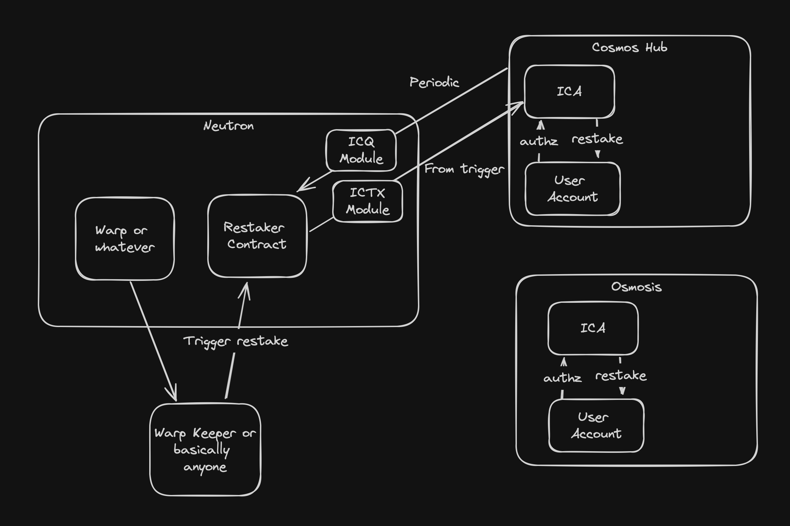

# awesomewasm-2024

  <h1 align="center">InterChadz</h1>
  <h3>ICA restaker on Neutron</h3>
  

💸 Given the recent news about Yieldmos being taken down, there is a need for a new restaking solution. InterChadz uses a restaking contract deployed on Neutron where users pay a fee to set up automated stake compounding.

⚙️ Built with interchian accounts + authz + Neutron Cron.

## Flow

## Screenshots

| Landing Page                               | Restaking dashboard                        |
| ------------------------------------------ | ------------------------------------------ |
|  |  |

| Compounding                                | Other screenshot                           |
| ------------------------------------------ | ------------------------------------------ |
|  |  |

## Project setup

For detailed instructions to start the dApp, see the respective readme files:

- [Frontend installation instructions](https://github.com/InterChadz/awesomewasm-2024/blob/main/frontend/README-Vue.md)
- [Contracts installation instructions](https://github.com/InterChadz/awesomewasm-2024/blob/main/cosmwasm/README.md)

## Hackathon tracks

### Neutron Track - Free-form project track

### Neutron + Abstract Bonus Bounty

## Links

- [Vercel deployment](https://wasm-theta.vercel.app/)
- [Presentation slides]()
- [Demo video]()
- [Github repo](https://github.com/InterChadz/awesomewasm-2024)
- [Twitter/X profile](https://x.com/TheInterChadz)

## Team

This project was build during AwesomWasm Hackathon 2024 by:

- [Gjermund Garaba](https://x.com/GjermundGaraba)
- [magiodev](https://x.com/magiodev)
- [arjanjohan](https://x.com/arjanjohan/)
