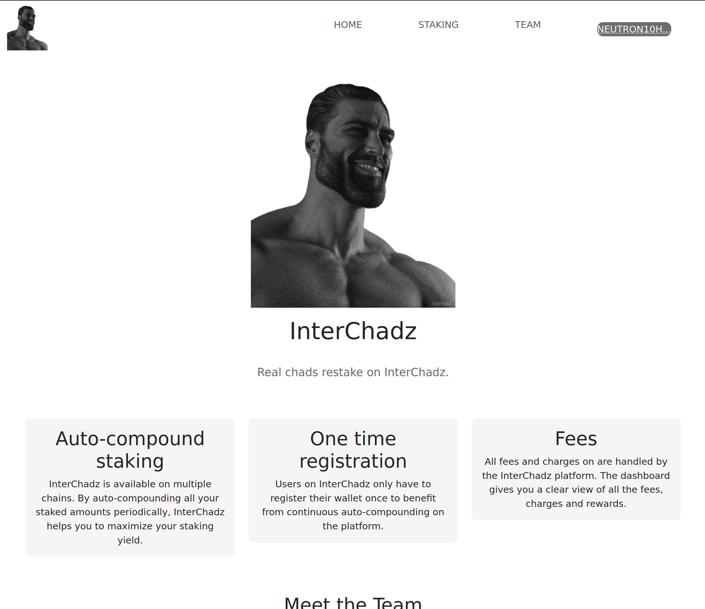

  <h1 align="center">InterChadz</h1>
  <h3>ICA restaker on Neutron</h3>
  

## Summary

This project is a decentralized staking auto-compounder that leverages ICA, authz and Neutron to 
let the user set-and-forget their staking positions. The user can register on multiple networks
and autocompound their staking rewards.

💸 Given the recent news about Yieldmos being taken down, there is a need for a new restaking solution. InterChadz uses a restaking contract deployed on Neutron where users pay a fee to set up automated compounding of staking rewards.

⚙️ Built with interchain accounts + authz + Neutron ICX and ICQ.

## Flow

The contract has a single ICA account on every supported chain that the user will give MsgDelegate Authz permissions to.

The contract leverages the Neutron ICQ module to get all the information it needs to calculate the users pending rewards (it's quite a bit, because the rewards are not actually stored in the state machine (and therefor is currently unavailable for ICQ) and is always calculated on the fly).

There is a single permissionless endpoint that triggers auto-compounding for all the users on all the networks.
It simply checks which users are due for an auto-compounding and sends out Authz Exec with MsgDelegate to the ICA account.

Automated triggering of the endpoint can be done by anyone (it is incentivized)

### Economics

To cover cost of 

### Initial registration flow

1. User sends registration tx to the contract with the network(s) they want to autocompound on and their address
2. The contract creates one ICA on each network for the user
3. Register periodic ICQ for the ICA balance (done in the callback, since we don't know the address beforehand)
4. User send authz tx (for the delegate message) for each ICA, one transaction for each network they want to autocompound on.

## Screenshots

| Landing Page                     | Restaking dashboard              |
| -------------------------------- | -------------------------------- |
|  |  |

| Topping up balance               | Team page                        |
| -------------------------------- | -------------------------------- |
|  |  |

## Project setup

For detailed instructions to start the dApp, see the respective readme files:

- [Frontend installation instructions](https://github.com/InterChadz/awesomewasm-2024/blob/main/frontend/README-Vue.md)
  - The frontend can also be accessed [here](https://interchadz.vercel.app/). Please note that the contracts still need to be running locally for this.
- [Contracts installation instructions](https://github.com/InterChadz/awesomewasm-2024/blob/main/cosmwasm/README.md)

## Functions

### RegisterUser

This function is available on the staking dashboard as a toggle. When restaking is not enabled, users can activate it by clicking the toggle. A transaction is initiated, with `chainId`, `address` and `validators` as parameters. The chainid and address are available in the state, and the validators are queried from the chain.

### Autocompound

This function triggers the autocompound feature, compounding all pending rewards to the staked balances.

### TopupUserBalance

TODO

## Links

- [Vercel deployment](https://interchadz.vercel.app/)
- [Presentation slides](https://docs.google.com/presentation/d/1IYWVWDWnHKXnIZhBLLIKgeaYTuGvEGsnP0QN7qjfSZY/edit?usp=sharing)
- [Demo video]()
- [Github repo](https://github.com/InterChadz/awesomewasm-2024)
- [Dorahacks Buidl](https://dorahacks.io/buidl/12895)
- [Twitter/X profile](https://x.com/TheInterChadz)

## Team

This project was build during AwesomWasm Hackathon 2024 by:

- [Gjermund Garaba](https://x.com/GjermundGaraba)
- [magiodev](https://x.com/magiodev)
- [arjanjohan](https://x.com/arjanjohan/)
